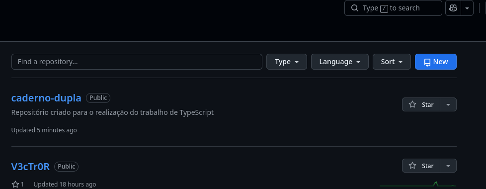
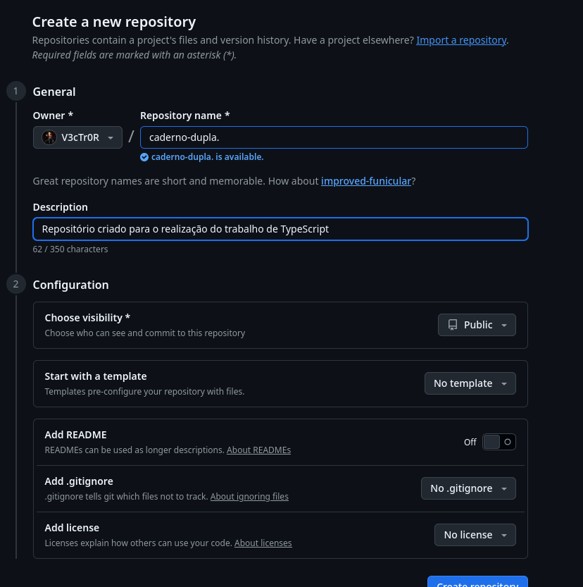
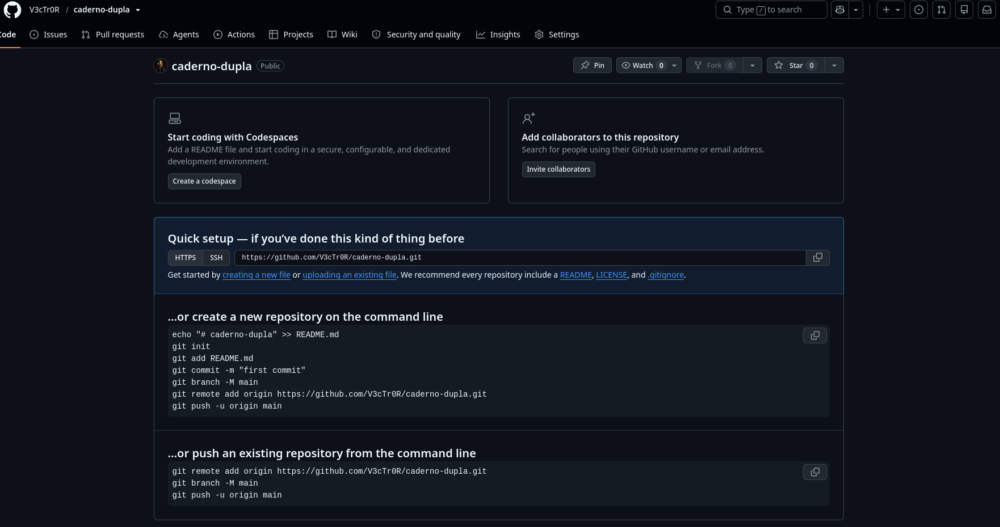
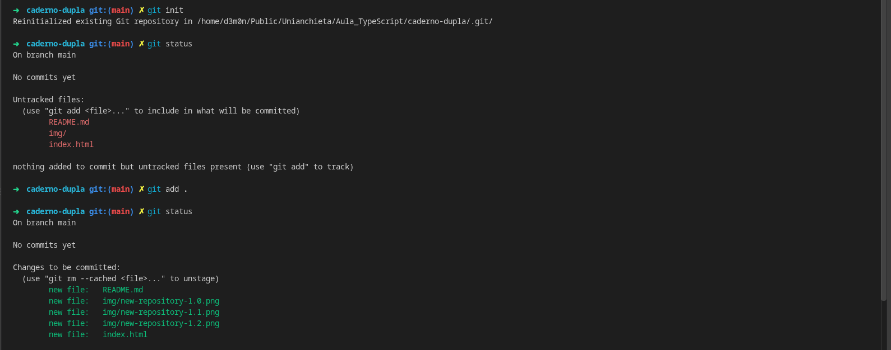
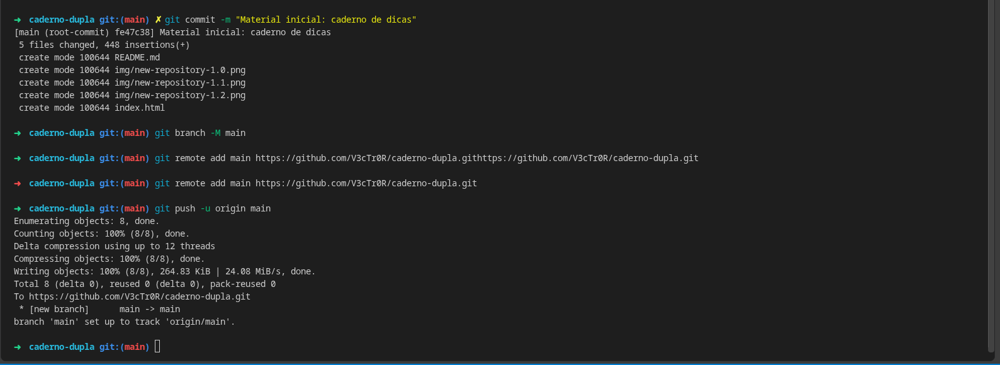
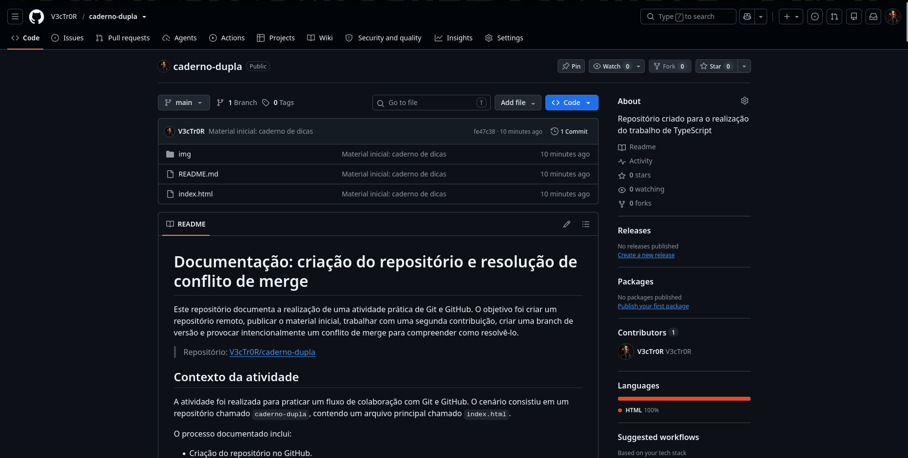

# Documentação: criação do repositório e resolução de conflito de merge

Este repositório documenta a realização de uma atividade prática de Git e GitHub. O objetivo foi criar um repositório remoto, publicar o material inicial, trabalhar com uma segunda contribuição, criar uma branch de versão e provocar intencionalmente um conflito de merge para compreender como resolvê-lo.

> Repositório: [V3cTr0R/caderno-dupla](https://github.com/V3cTr0R/caderno-dupla)

## Contexto da atividade

A atividade foi realizada para praticar um fluxo de colaboração com Git e GitHub. O cenário consistiu em um repositório chamado `caderno-dupla`, contendo um arquivo principal chamado `index.html`.

O processo documentado inclui:

- Criação do repositório no GitHub.
- Inicialização e publicação do projeto local.
- Inclusão de alterações no arquivo principal.
- Criação da branch `Versao0.2`.
- Alteração concorrente da mesma linha do arquivo.
- Recusa de um `push` desatualizado.
- Identificação e resolução manual do conflito de merge.

## Criação do repositório

O repositório foi criado no GitHub a partir da opção **New**.

<!-- IMAGEM 1: inserir uma captura da página de repositórios mostrando o botão “New”.
Caminho sugerido: ./img/new-repository-1.0.jpg -->



Na criação, foram definidas as seguintes configurações:

| Campo | Configuração utilizada |
|---|---|
| Proprietário | `V3cTr0R` |
| Nome do repositório | `caderno-dupla` |
| Descrição | Repositório criado para a realização do trabalho de TypeScript |
| Visibilidade | Público |
| Template | Nenhum |
| README inicial | Desativado |
| `.gitignore` | Nenhum |
| Licença | Nenhuma |

O repositório foi deixado vazio, sem README, licença ou `.gitignore` criados pelo GitHub. Essa escolha permitiu publicar o primeiro conteúdo diretamente a partir da cópia local do projeto, sem necessidade de sincronizar arquivos iniciais já existentes no remoto.

<!-- IMAGEM 2: inserir a tela “Create a new repository” preenchida, antes de clicar em “Create repository”.
Caminho sugerido: ./img/new-repository-1.1.jpg -->



Após a criação, o GitHub apresentou a URL remota que seria usada para conectar o projeto local:

```text
https://github.com/V3cTr0R/caderno-dupla.git
```

<!-- IMAGEM 3: inserir a tela de “Quick setup” do repositório vazio, contendo a URL HTTPS.
Caminho sugerido: ./img/new-repository-1.2.jpg -->



## Publicação inicial do projeto

O projeto local já possuía o arquivo `index.html`, que representa o conteúdo inicial do repositório. A partir da pasta do projeto, o Git foi inicializado e o arquivo foi incluído no primeiro commit.

```bash
git init
git add index.html
git commit -m "Material inicial: caderno de dicas"
git branch -M main
git remote add origin https://github.com/V3cTr0R/caderno-dupla.git
git push -u origin main
```

Nesse momento, o repositório local passou a possuir uma branch principal chamada `main`, conectada ao repositório remoto `origin`.

O primeiro commit registrou o estado inicial do arquivo antes das contribuições colaborativas e antes do teste de conflito.

<!-- IMAGEM 4: Terminal mostrando o primeiro commit e o push concluído com sucesso. -->




<!-- IMAGEM 5: Página do GitHub após o primeiro push, mostrando index.html e o primeiro commit. -->

A página do repositório no GitHub passou a exibir o arquivo `index.html` e o commit inicial.



## Preparação para o trabalho colaborativo

Para representar a colaboração entre duas pessoas, o segundo participante utilizou uma cópia clonada do repositório. O clone preserva o histórico de commits e já configura o repositório remoto como `origin`.

```bash
git clone https://github.com/V3cTr0R/caderno-dupla.git
cd caderno-dupla
```

No `index.html`, foi adicionada uma nova contribuição. Essa alteração foi registrada e enviada para a branch `main`.

```bash
git add index.html
git commit -m "Adiciona dica do Aluno B"
git push origin main
```

Com isso, a branch `main` passou a conter contribuições de mais de um autor, formando o histórico necessário para a etapa seguinte.

<!-- IMAGEM 6: Terminal ou a aba “Commits” mostrando o commit “Adiciona dica do Aluno B”. -->

```text


```

## Criação da branch Versao0.2

Antes de provocar o conflito, foi criada uma branch separada chamada `Versao0.2`. O objetivo dessa branch foi registrar uma nova versão do projeto sem alterar diretamente o código da `main`.

```bash
git checkout main
git pull origin main
git checkout -b Versao0.2
```

Na branch de versão, foi criado um novo arquivo, como `paginaNova.html`. Depois, a alteração foi registrada e publicada:

```bash
git add .
git commit -m "Versao0.2 - Inclui paginaNova.html"
git push -u origin Versao0.2
```

A branch `Versao0.2` ficou disponível no GitHub de forma independente da `main`. Isso demonstra como branches permitem desenvolver alterações isoladas antes de uma possível integração com a versão principal.

<!-- IMAGEM 7: inserir o terminal mostrando a criação da branch Versao0.2 e o push.
Sugestão: mostrar também o resultado de git branch. -->

```text
[INSERIR IMAGEM: criação e publicação da branch Versao0.2]
```

<!-- IMAGEM 8: inserir o seletor de branches do GitHub mostrando main e Versao0.2. -->

```text
[INSERIR IMAGEM: branches main e Versao0.2 no GitHub]
```

## Situação que causou o conflito

O conflito foi provocado propositalmente na branch `main`. Antes de editar, as duas cópias locais foram atualizadas para partir do mesmo estado:

```bash
git checkout main
git pull origin main
```

Os dois participantes editaram a mesma linha do arquivo `index.html`, especificamente o título dentro da tag `<h1>`, porém com textos diferentes.

A linha original era semelhante a esta:

```html
<h1>Caderno de Dicas de Git</h1>
```

Na primeira cópia local, o título foi alterado para:

```html
<h1>Caderno colaborativo de Git</h1>
```

Na segunda cópia local, a mesma linha foi modificada para:

```html
<h1>Guia prático de Git e GitHub</h1>
```

O conflito ocorreu porque as duas alterações modificaram o mesmo trecho do arquivo, mas com conteúdos incompatíveis.

<!-- IMAGEM 9: inserir uma captura comparando as duas versões do título ou mostrando as duas cópias do index.html antes do push. -->

```text
[INSERIR IMAGEM: alterações diferentes feitas na mesma linha]
```

## Primeiro envio para a main

A primeira alteração foi enviada normalmente para o GitHub:

```bash
git add index.html
git commit -m "Altera titulo (Aluno A)"
git push origin main
```

Como essa cópia local estava atualizada em relação ao repositório remoto, o Git aceitou o `push` e adicionou o novo commit à branch `main`.

<!-- IMAGEM 10: inserir o terminal mostrando o push bem-sucedido do commit “Altera titulo (Aluno A)”. -->

```text
[INSERIR IMAGEM: primeiro push aceito pelo GitHub]
```

## Recusa do segundo push

Na segunda cópia local, a mesma linha já tinha sido editada. Entretanto, essa cópia ainda não possuía o commit enviado anteriormente para o repositório remoto.

A alteração foi registrada localmente:

```bash
git add index.html
git commit -m "Altera titulo (Aluno B)"
```

Ao tentar enviá-la, o Git recusou o `push`:

```bash
git push origin main
```

A recusa ocorre porque a branch remota contém um commit que não existe na cópia local. O Git impede que esse novo envio substitua o histórico remoto sem antes integrar as alterações que já foram publicadas.

Uma mensagem semelhante à seguinte é exibida:

```text
! [rejected]        main -> main (fetch first)
error: failed to push some refs
hint: Updates were rejected because the remote contains work that you do not have locally.
```

<!-- IMAGEM 11: inserir a captura do terminal mostrando o push recusado e a mensagem de erro. -->

```text
[INSERIR IMAGEM: push recusado por branch local desatualizada]
```

## Identificação do conflito de merge

Para obter a alteração existente no repositório remoto, foi executado:

```bash
git pull origin main
```

O Git conseguiu baixar o commit remoto, mas não conseguiu combinar automaticamente as duas versões da mesma linha. Por isso, interrompeu o processo e informou um conflito de conteúdo no `index.html`.

```text
CONFLICT (content): Merge conflict in index.html
Automatic merge failed; fix conflicts and then commit the result.
```

Ao abrir o arquivo, foram exibidas as marcações de conflito:

```html
<<<<<<< HEAD
<h1>Guia prático de Git e GitHub</h1>
=======
<h1>Caderno colaborativo de Git</h1>
>>>>>>> origin/main
```

Essas marcações representam:

| Marcação | Significado |
|---|---|
| `<<<<<<< HEAD` | Início da alteração que estava na cópia local atual. |
| `=======` | Separação entre as duas versões concorrentes. |
| `>>>>>>> origin/main` | Final da alteração recebida do repositório remoto. |

<!-- IMAGEM 12: inserir a captura do terminal após git pull, mostrando “CONFLICT (content)”. -->

```text
[INSERIR IMAGEM: Git informando o merge conflict]
```

<!-- IMAGEM 13: inserir uma captura do VS Code mostrando as marcações <<<<<<<, ======= e >>>>>>> no index.html. -->

```text
[INSERIR IMAGEM: marcações de conflito dentro do index.html]
```

## Resolução aplicada

A resolução não consistiu apenas em escolher uma das versões. As duas ideias foram combinadas em um título único:

```html
<h1>Caderno colaborativo: Guia prático de Git e GitHub</h1>
```

Após definir o conteúdo final, todas as marcações de conflito foram removidas do arquivo. O `index.html` foi salvo sem os delimitadores `<<<<<<<`, `=======` e `>>>>>>>`.

A resolução foi então adicionada ao Git, registrada em um commit e enviada ao GitHub:

```bash
git add index.html
git commit -m "Resolve conflito no titulo"
git push origin main
```

Esse commit representa a decisão final tomada para integrar as duas alterações concorrentes.

<!-- IMAGEM 14: inserir a captura do index.html já corrigido, sem as marcações de conflito. -->

```text
[INSERIR IMAGEM: arquivo corrigido após decidir o conteúdo final]
```

<!-- IMAGEM 15: inserir o terminal mostrando o commit “Resolve conflito no titulo” e o push concluído. -->

```text
[INSERIR IMAGEM: commit e push da resolução do conflito]
```

## Resultado final

Ao final do processo, o repositório deve conter:

- A branch `main` com o conteúdo principal e o conflito resolvido.
- A branch `Versao0.2` com a nova página criada durante a atividade.
- Commits referentes ao conteúdo inicial, à contribuição do segundo participante, às alterações concorrentes e à resolução do conflito.
- O arquivo `index.html` sem qualquer marcador de conflito.

Para conferir o estado final do repositório, foram utilizados os comandos abaixo:

```bash
git status
git branch
git log --oneline --graph --all
git remote -v
```

Um histórico semelhante ao seguinte é esperado:

```text
*   <hash> Resolve conflito no titulo
|\
| * <hash> Altera titulo (Aluno A)
* | <hash> Altera titulo (Aluno B)
|/
* <hash> Adiciona dica do Aluno B
* <hash> Material inicial: caderno de dicas
```

<!-- IMAGEM 16: inserir a saída real de git log --oneline --graph --all. -->

```text
[INSERIR IMAGEM: histórico final de commits]
```

<!-- IMAGEM 17: inserir a página principal do GitHub mostrando o resultado final do repositório. -->

```text
[INSERIR IMAGEM: resultado final no GitHub]
```

## Conclusão

A atividade mostrou que um conflito de merge não representa perda de trabalho. Ele indica que o Git encontrou alterações concorrentes e precisa de uma decisão humana para definir o resultado final.

O `git add` prepara os arquivos corrigidos, o `git commit` registra a resolução no histórico local e o `git push` publica essa resolução no GitHub. A recusa inicial do `push` foi uma proteção do Git para evitar a substituição indevida de commits já existentes no repositório remoto.

Como prática de trabalho colaborativo, o fluxo adotado foi:

```text
pull → editar → add → commit → pull → push
```

Executar `git pull` antes de iniciar uma nova alteração reduz as chances de trabalhar sobre uma versão desatualizada e, consequentemente, diminui a ocorrência de conflitos.

## Autor

Jonhnes Monteiro
